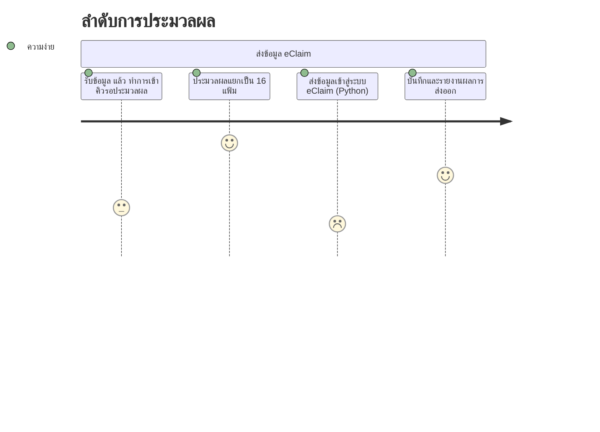
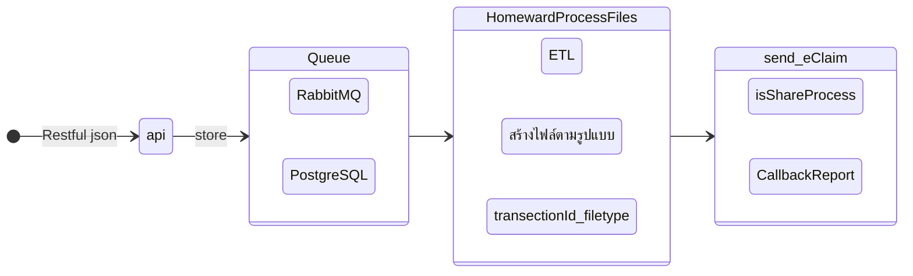
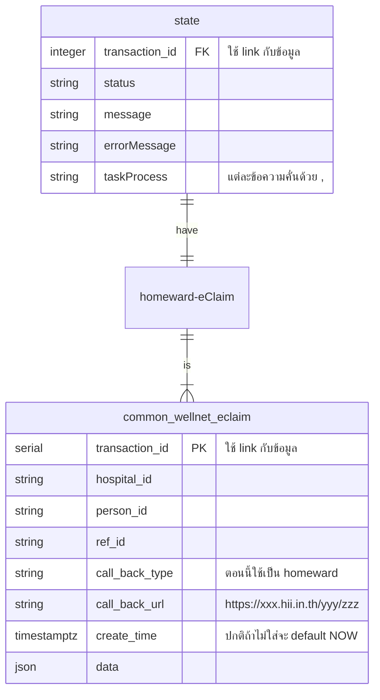
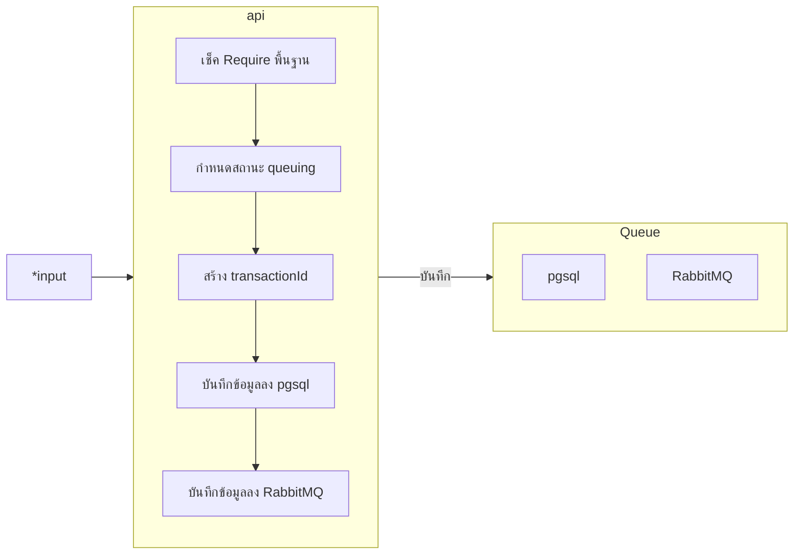
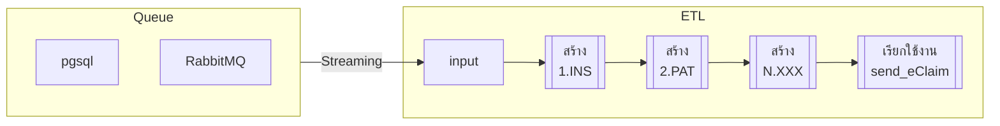
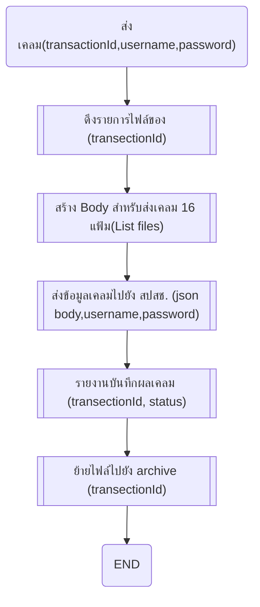
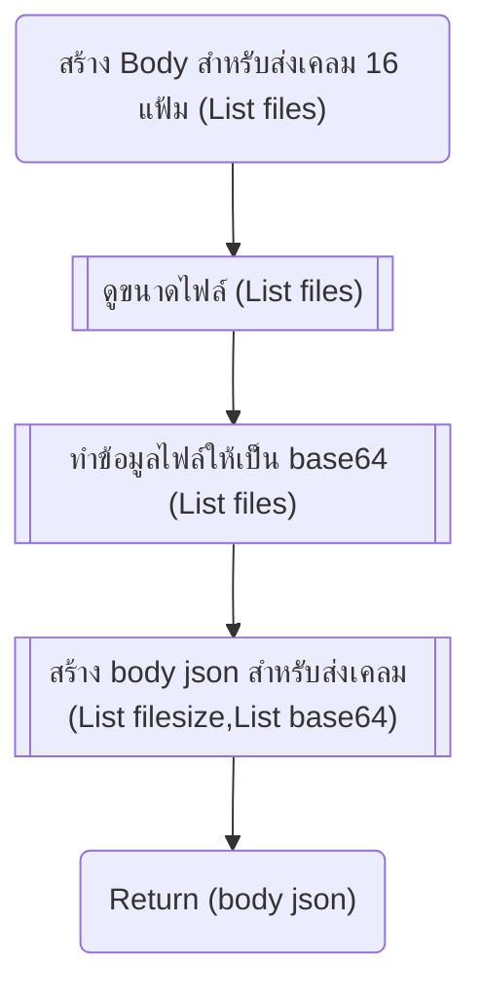
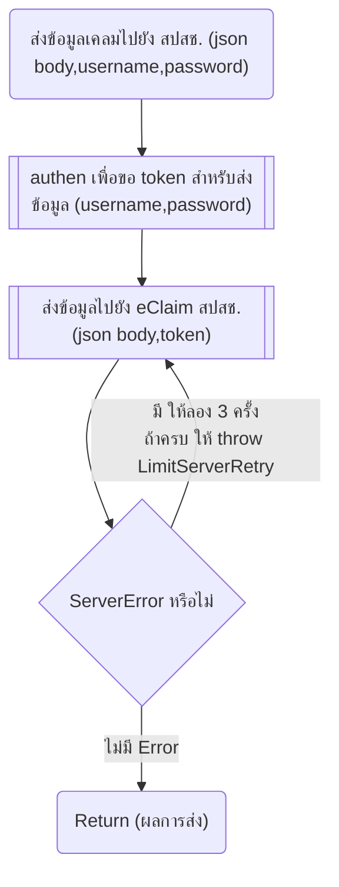
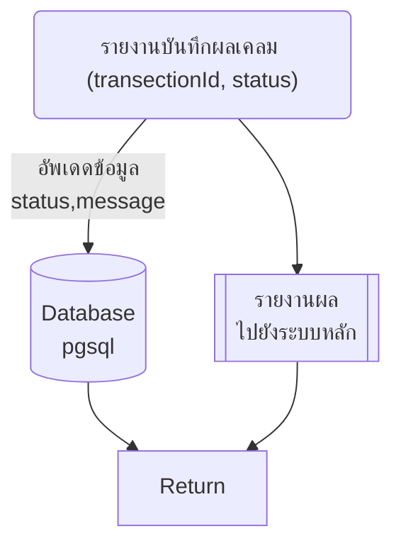

# design

โครงสร้างชื่อไฟล์  
`{transectionId}_{filetype}_{สิทธิการรรักษา}`
- transectionId รหัสที่ระบบสร้างขึ้นมา
- filetype รูปแบบของไฟล์ 16 แฟ้ม INS, PAT, IPD, อื่นๆ  

example
```
sdfasd54sd654825_INS_UCS.txt
sdfasd54sd654825_ADP_UCS.txt
sdfasd54sd654825_CHA_UCS.txt
asasd54sd654826_INS_SSS.txt
asfasd54sd654826_ADP_SSS.txt
asfasd54sd654826_CHA_SSS.txt
```


## รายละเอียดการประมวลผล  

# ER


Note:  
https://x-team.com/blog/automatic-timestamps-with-postgresql/  
https://stackoverflow.com/questions/68066248/how-to-get-the-inserted-row-in-kotlin-exposed  
  
https://docs.confluent.io/kafka-clients/java/current/overview.html#java-example-code  
https://kafka.apache.org/25/documentation/streams/developer-guide/config-streams.html  

# Flowchart
## api  


# ETL Flow


ตอนสร้างไฟล์ อย่าลืมเช็คสิทธิเก็บไว้ด้วย เพราะการส่งข้อมูลแต่ละชุด ต้องมีการแยกตามสิทธิ์ `UCS, OFC, LGO, SSS`
# Main function send_eClaim Flow

## Sub function สร้าง Body สำหรับส่งเคลม 16 แฟ้ม  


Note:
file to base64 https://www.adamsmith.haus/python/examples/1892/base64-encode-a-file-in-%60base64%60  
get file size https://www.geeksforgeeks.org/how-to-get-file-size-in-python/  
## Sub function ส่งข้อมูลเคลมไปยัง สปสช.

## Sub function รายงานบันทึกผลเคลม

Note:  
python pgsql https://www.postgresqltutorial.com/postgresql-python/  

