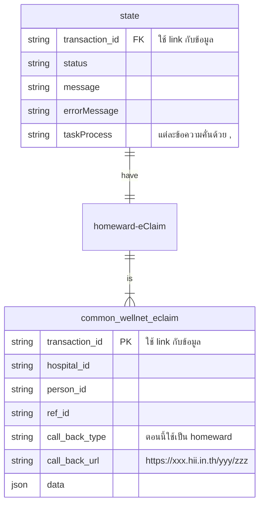
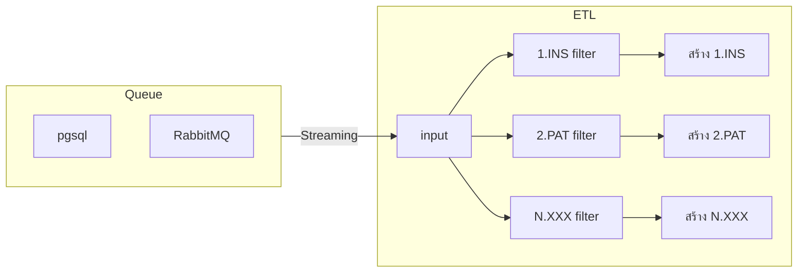

# design

โครงสร้างชื่อไฟล์  
`{transectionId}_{filetype}`
- transectionId รหัสที่ระบบสร้างขึ้นมา
- filetype รูปแบบของไฟล์ 16 แฟ้ม INS, PAT, IPD, อื่นๆ  

example
```
sdfasd54sd654825_INS.txt
sdfasd54sd654825_ADP.txt
sdfasd54sd654825_CHA.txt
asasd54sd654826_INS.txt
asfasd54sd654826_ADP.txt
asfasd54sd654826_CHA.txt
```


## รายละเอียดการประมวลผล  

# ER


# Flowchart

## api


# ETL Flow



# Main function send_eClaim Flow

## Sub function สร้าง Body สำหรับส่งเคลม 16 แฟ้ม  


## Sub function ส่งข้อมูลเคลมไปยัง สปสช.

## Sub function รายงานบันทึกผลเคลม

